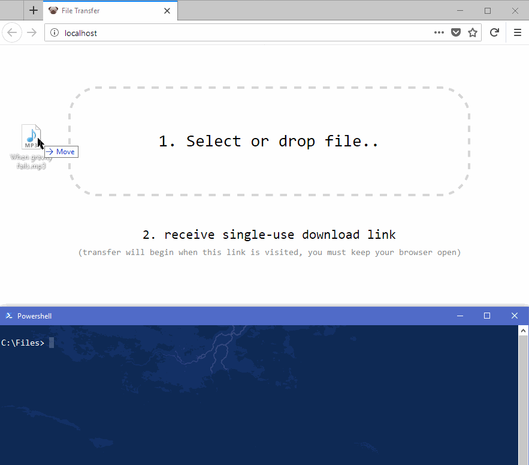

## webrelay.exe
Command line utility for hosting a file or stream over HTTP. It can be installed as a service (`webrelay --install`) to move the HTTP server out-of-process or to another machine. A test instance is running at [fy.lc](http://fy.lc).
```powershell
Webrelay [[-listenPrefix] <String>] [[-remoteHost] <String>] [[-filename] <String>] [[-contentType] <String>] [-inline] [[-maxConnections] <Int>] inputFile
```

Parameter | Description
----------|------------
listenPrefix `-l` | Hostname and port on which to listen (e.g.: http://*:80/)
remoteHost `-r` | Remote instance to relay through instead of listening on this machine (e.g.: ws://fy.lc)
filename `-f` | Value to be used in content-disposition header, defaults to input filename unless --inline is specified
inline `-i` | Use inline content-disposition (no download prompt)
contentType `-c` | Value to be used in content-type header, defaults to "text/plain" if filename is blank
maxConnections `-m` | (Default: 8) Max concurrent connections
install | Install service
uninstall | Uninstall service
username | (Default: LocalSystem) Username for service (ignored unless --install is specified)
password | Password for service if necessary (ignored unless --install is specified)
help | Display this help screen.
version | Display version information.

some usage examples:


webclient:



shell extension:


